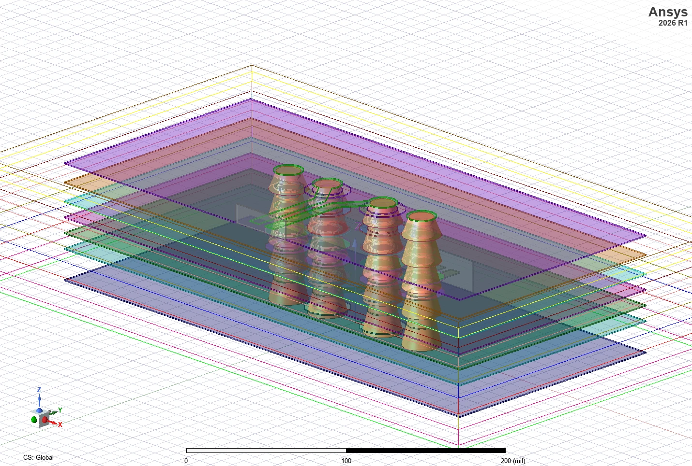

# HFSS Funnel Via Toolkit

以 PyAEDT 建立 HFSS 3D Layout 無法直接產生的漏斗狀堆疊雷射微孔（stacked laser via）。工具以多段圓錐台沿 Z 軸堆疊，可對齊並取代既有的等徑 via。



提供兩種版本：

| 版本 | 位置 | 適用對象 |
|------|------|---------|
| **網頁版（建議）** | [`funnel-via-web/`](funnel-via-web/) | 一般使用者。雙擊 `start.bat` 即可，含 Three.js 即時 3D 預覽 |
| 桌面版（Tkinter） | [`funnel_via_gui.py`](funnel_via_gui.py) | 已有 Python 環境、習慣單檔腳本者 |

## 主要功能

- 從同專案的 **3D Layout 設計自動讀取真實疊構**（層數、厚度、真實層 Z）。
- 依疊構自動產生 layer transition 段數。
- 抓取 AEDT 中選取的 via，或依名稱前綴自動掃描整個設計。
- 以真實層 Z 定位漏斗節點（純平移對齊，對 via 殘段／防焊免疫）。
- 產生多段漏斗狀 via 幾何，可一併刪除原本的等徑圓柱 via。

## 快速開始（網頁版）

1. 綠色 **Code** 按鈕 → **Download ZIP**，或到 **Releases** 下載版本化 ZIP。
2. **完整解壓縮**到本機資料夾（勿直接從 ZIP 內執行）。
3. 開啟 AEDT，載入要加 via 的 HFSS 專案與設計。
4. 進入 `funnel-via-web`，**雙擊 `start.bat`**。
5. 首次啟動會自動建立 `backend\.venv` 並下載套件（需要網路，約數分鐘）；就緒後自動開啟 `http://127.0.0.1:8010`。
6. 關閉啟動視窗即停止服務。

完整步驟、介面說明與常見問題：**[docs/操作說明.md](docs/操作說明.md)**

## 練習用範例專案

手邊沒有適合的板子也可以先練習：repo 內附 [`Diff_Via_Example.aedtz`](Diff_Via_Example.aedtz)（AEDT 封存專案，約 0.6 MB），已同時包含工具需要的兩種設計：

| 設計 | 型態 | 用途 |
|------|------|------|
| `diffViaNominal` | HFSS 3D Layout | 疊構來源（工具讀取真實層 Z） |
| `HFSSDesign1` | HFSS 3D | via 所在、漏斗建立的地方 |

在 AEDT 以 **File → Open** 直接開啟 `.aedtz`（AEDT 會自動解壓成專案），切到 `HFSSDesign1`，即可照 [docs/操作說明.md](docs/操作說明.md) 的流程走一遍。範例中的 via 名稱以 `via_` 開頭，可直接用「自動抓取」。

## 環境需求

**必須自行安裝：**

- Windows 10／11（64 位元）
- **Ansys Electronics Desktop（含 HFSS）** ── 商業授權軟體，請使用貴公司正式安裝版。本工具不含任何 Ansys 元件，也不會繞過授權。

**啟動腳本自動處理：**

- Python 3.10／3.11／3.12（64 位元）。若機器上只有不相容版本，會以 WinGet 在**使用者範圍**額外安裝 Python 3.12，**不會刪除或降級既有的 Python**。
- `funnel-via-web/backend/.venv` 虛擬環境與 `requirements.lock.txt` 內的套件（fastapi、uvicorn、websockets、pydantic、pyaedt），全部隔離在專案資料夾內。
- 前端已預先建置於 `frontend/dist`，**一般使用者不需要 Node.js**。

## 隱私與網路

服務只綁定 `127.0.0.1`，不對外網開放，疊構、座標與專案資料**不會上傳**。唯一的網路行為是首次啟動時下載 Python 套件。

## 維護者：開發模式

需要 Node.js 18 以上：

```bat
cd funnel-via-web
dev.bat
```

後端 `127.0.0.1:8010`、前端 Vite dev server `127.0.0.1:5180`（熱更新）。改完前端後，發布前務必重新建置並提交 `frontend/dist`：

```bat
cd funnel-via-web\frontend
npm ci
npm run build
```

## 公開範圍

本 Repository 以腳本與功能展示為主。AEDT 專案（`.aedt` / `.aedb` / `.aedtz`）與模擬結果不列入版本控制。

如需完整商用版本、AEDT 版本相容性調整或客製化整合，請來信洽詢。

此工具由虎門科技資深技術工程師 Jeff Hong 洪敬傑提供
